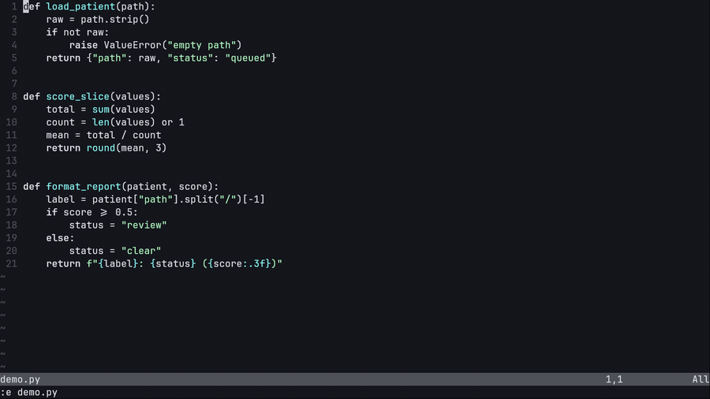

<p align="center"></p>

# Yana

Yana was built after using the existing Neovim agent plugins and finding their
inline-edit and hunk-review experience unreliable: edits that landed in the
wrong place, a review that lost track of what had already been decided, an
undo that didn't actually take you back. Yana exists to make exactly that part
dependable — the agent proposes, you see every change as a hunk in your own
buffer, you accept or reject each one, and undo retraces your own steps, the
way the editor's own undo should. Nothing reaches disk until you say so.

## Features

- Ask the agent about your code without it touching anything (`ask` mode)
- Let it edit, and review every change as a hunk in your own buffer before it lands
- Accept or reject one hunk, one file, or the whole turn
- Undo your last decision — across files — and the hunk comes back where you can see it; redo it
- Reset the whole turn with one key
- Switch which agent answers — Cursor, Claude, or Codex — and which model, mid-chat (Claude and Codex are experimental — see Installation)
- Keep your unsaved typing: an accept never overwrites it
- After a crash, the dead turn's lock on the project is released so the next editor is not blocked (pending hunks are NOT restored)
- Resume a past chat, with its open review intact
- Stop a stuck turn with one command
- See which model actually answered, and be told if it wasn't the one you asked for
- Edit just the selected lines without leaving the buffer
- Edit more than one repository in a single turn, reviewed the same way
- Queue several requests; they run in order
- Watch a turn work or stall, instead of a bare spinner
- See exactly what was refused, and why
- Restrict which programs an inline turn can execute, enforced by the kernel (alpha)
- Record a turn's raw output and per-event history for a bug report, on request
- The agent can't read your SSH keys or cloud credentials, or rewrite your git history

## Installation

**Required:** Linux for confined `ask` / `inline` (glibc — musl/Alpine does not work, see Known issues). macOS can run **agentic** only (see below). Neovim 0.11.2+; one agent CLI signed in: `cursor-agent`, or, **experimental**, `claude` or `codex`.

### Quick installation with lazy.nvim

Put this in `~/.config/nvim/lua/plugins/yana.lua`. It is a complete plugin
specification: install an agent CLI first, then start Neovim and run `:Yana`.

```lua
return {
  "drusmanbashir/yana.nvim",
  cmd = { "Yana", "YanaAsk", "YanaEdit", "YanaOpen" },
  build = "scripts/install-deps.sh",
  opts = {
    backend = "cursor", -- "cursor", "claude", or "codex"
    global_keymaps = {
      toggle = "<leader>cc",
      ask = "<leader>ca",
      inline_edit = "<C-k>",
    },
  },
}
```

`build` checks required system programs on install and update. It reports what
is missing but does not install system packages without asking.

The same ready-to-use file is in
[`examples/lazy.nvim/yana.lua`](examples/lazy.nvim/yana.lua).

### System requirements

**Get Neovim 0.11.2+ first.** `apt` on Ubuntu 24.04 and older installs an
older Neovim (0.9.5 on a stock Ubuntu 24.04 image, verified) with no warning
that it is below Yana's floor — `:checkhealth yana` catches it, but only
after you have already tried to run Yana. On Debian/Ubuntu, Neovim's own
install docs ([neovim.io/doc/install](https://neovim.io/doc/install/))
document two ways to get 0.11.2+:

- **AppImage** (no install, no root):
  ```sh
  curl -LO https://github.com/neovim/neovim/releases/latest/download/nvim-linux-x86_64.appimage
  chmod u+x nvim-linux-x86_64.appimage
  ./nvim-linux-x86_64.appimage
  ```
- **The `neovim-ppa/unstable` PPA** (not maintained by the Neovim team; gives you `apt upgrade` for Neovim going forward):
  ```sh
  sudo add-apt-repository ppa:neovim-ppa/unstable
  sudo apt-get update
  sudo apt-get install neovim
  ```

Then install the system packages:

**Debian / Ubuntu**
```sh
sudo apt-get install -y bubblewrap libcap2-bin python3 util-linux findutils gawk libc-bin hostname
```

**Fedora / RHEL**
```sh
sudo dnf install -y bubblewrap libcap python3 util-linux findutils gawk glibc-common hostname
```
Fedora/RHEL is tested in a container with SELinux labelling disabled. With
SELinux enforcing on a desktop, bubblewrap may need the `container_use_devices`
or an equivalent boolean; if `:checkhealth yana` reports `bwrap:userns`
failing with a permission error and the sysctl remedy does not apply, check
`ausearch -m avc -ts recent` first.

**Arch**
```sh
sudo pacman -S --needed bubblewrap libcap python3 util-linux findutils gawk glibc inetutils
```

**macOS**

Confined `ask` / `inline` (overlay + hunk review) need Linux kernel facilities
Homebrew cannot provide: bubblewrap, overlayfs, `/proc`, capsh. On Darwin,
Yana **refuses those modes before the agent starts**. It does not silently
switch to `agentic`.

To chat and edit on a Mac without confinement (the agent writes your real
tree; there is no overlay and no hunk review):

```lua
require("yana").setup({
  enable_agentic = true,
  mode = "agentic",
})
```

Then install an agent CLI. `cursor-agent` on macOS:

```sh
curl https://cursor.com/install -fsS | zsh
xattr -cr ~/.local/share/cursor-agent/
```

`scripts/install-deps.sh` on Darwin prints this same split and only checks
`cursor-agent`. For hunk review, run Yana on Linux.

Everything else Yana needs on Linux — `bash`, `sed`, `grep`, and standard coreutils — ships
with any mainstream distro already. `scripts/install-deps.sh` (still in the repo)
checks the complete list against your actual machine and prints only what's
really missing; `:checkhealth yana` does the same check after `setup()` has run.

Then install whichever agent CLI you plan to use. All three are selectable
with `backend = "cursor" | "claude" | "codex"`, but only `cursor` is
exercised end-to-end by this repo's own test suite (real spawn + stream +
apply, against a fake binary standing in for the vendor); `claude` and
`codex` are wired the same way in code but have no such coverage here yet
(config-shape and stream-parsing tests only) — treat them as **experimental**
until that changes.

- **`cursor-agent`** — install line from Cursor's own docs
  ([cursor.com/docs/cli/installation](https://cursor.com/docs/cli/installation)):
  ```sh
  curl https://cursor.com/install -fsS | bash
  ```
  What you need: a Cursor account. Sign in with `cursor-agent login`, or set
  `CURSOR_API_KEY`.

- **`claude`** (Claude Code CLI) — **experimental**, not verified end-to-end
  in this repo's tests. Install line from Anthropic's own docs
  ([code.claude.com/docs/en/setup](https://code.claude.com/docs/en/setup)):
  ```sh
  curl -fsSL https://claude.ai/install.sh | bash
  ```
  What you need: an Anthropic Pro/Max/Team/Enterprise/Console account. Sign
  in by running `claude` and following the browser prompt, or set
  `ANTHROPIC_API_KEY`.

- **`codex`** (OpenAI Codex CLI) — **experimental**, not verified
  end-to-end in this repo's tests. Install line from OpenAI's own package
  ([npmjs.com/package/@openai/codex](https://www.npmjs.com/package/@openai/codex)):
  ```sh
  npm install -g @openai/codex
  ```
  What you need: an OpenAI account (ChatGPT Plus/Pro/Business/Edu/Enterprise).
  Sign in with `codex login`, or set `OPENAI_API_KEY`.

### Environment variables

All optional. Yana reads these directly:

```sh
# Only needed if cursor-agent isn't already on $PATH:
export YANA_AGENT_BIN=~/.local/bin/cursor-agent

# Optional machine profile file (Lua table), loaded from this variable:
export YANA_VENDOR_PROFILE=~/.config/nvim/yana-vendors.lua

# Opt-in diagnostics, both off by default:
export YANA_DEBUG_EVENTS=1     # record every turn's raw agent stream
export YANA_LIFECYCLE_LOG=1    # record what each turn did, event by event
```

`YANA_DEBUG_EVENTS` writes the raw stream and decoded `events.jsonl` into that
turn's private state directory. `YANA_LIFECYCLE_LOG` adds structured turn,
claim, and review rows to Yana's durable log. They exist for diagnosis and add
extra writes, so leave them unset for normal use.

`YANA_AGENT_BIN` is just the *default* variable name — point `cmd_env` at any
variable your shell already exports and Yana reads that one instead:

```lua
require("yana").setup({ cmd_env = "CURSOR_CLI_BIN" })
```
```sh
export CURSOR_CLI_BIN=~/.local/bin/cursor-agent
```

To pick which account bills from your shell instead of `:YanaBackend` every
session, read your own variable in your lazy.nvim spec and pass it through —
Yana itself never reads `YANA_BACKEND`, this is just the pattern:

```lua
opts = function()
  return { backend = vim.env.YANA_BACKEND or "cursor" }
end
```

`vendor_profile` is the same pattern, but for vendor entries and model defaults:

```lua
-- ~/.config/nvim/yana-vendors.lua (must return a table)
return {
  backend = "claude", -- default layer-1 backend for this machine
  model = "claude-sonnet-5", -- default layer-2 model for this machine
  backends = {
    claude = {
      cmd = "/home/me/.local/bin/claude",
    },
    codex = {
      cmd = "codex",
    },
  },
}
```

```lua
-- Lazy spec
require("yana").setup({
  vendor_profile = false, -- never load YANA_VENDOR_PROFILE for this one machine
})
```

### Manual installation

```sh
git clone https://github.com/drusmanbashir/yana.nvim ~/.local/share/nvim/yana.nvim
~/.local/share/nvim/yana.nvim/scripts/install-deps.sh
```

```lua
vim.opt.runtimepath:prepend("~/.local/share/nvim/yana.nvim")
require("yana").setup({})
```

### Verify installation

Run `:Yana` to open the panel; if it fails, `:checkhealth yana` names the missing package, the agent binary it tried, and the fix.

## Interface

Yana uses ordinary Neovim windows, winbars, highlights, and text decorations.
It adds no UI framework. The conversation header leads with `YANA · Inline`
and the confirmed backend/model; the input header says `Send follow-up…`.

The interface uses short result-focused labels. Configuration names remain
stable: `ask` appears as **Ask**, `inline` as **Inline**, and `agentic` as
**Agent**. Tool progress uses **Thinking**, **Explored**, **Edited**, and
**Ran**. Pending edits say **Review changes** and file-buffer decisions say
**Accept** or **Reject**.

## Default setup configuration

Most people need only this:

```lua
require("yana").setup({
  backend = "cursor",
  global_keymaps = { toggle = "<leader>cc", ask = "<leader>ca", inline_edit = "<C-k>" },
})
```

<details><summary><strong>Default setup configuration — every option</strong> (override only what you need; defaults are safe)</summary>

```lua
require("yana").setup({
  backend = "cursor",         -- "cursor" | "claude" | "codex" | your own entry in `backends`
  cmd = nil,                  -- explicit path/name; see "Environment variables" above
  cmd_env = "YANA_AGENT_BIN",
  vendor_profile = nil,       -- path/table/profile env var; load before opts
  model = nil,
  mode = "inline",             -- "ask" (reads and answers, edits nothing) | "inline" (edits arrive as hunks you review) | "agentic" (writes files directly, no review; needs enable_agentic)
  enable_agentic = false,
  approve_mcps = false,

  -- Extra directories a turn may write, beyond the one you opened.
  write_roots = {},

  -- ALPHA, nil by default: restrict inline execution to exactly this list.
  inline_exec_allowlist = nil,

  selection_scope = {
    enforce = "reject",
    unstructured = "warn",
  },

  ui = {
    width = 0.40,
    position = "right",
    prompt_height = 6,
    show_usage = true,
    show_thinking = false,
  },

  diff_highlights = {
    incoming = { link = "DiffAdd" },
    deleted = { link = "DiffDelete" },
    hint = { link = "Comment" },
  },

  -- Review keys, shown in the UI as Reject and Accept:
  diff_keymaps = {
    ours = "cr",        -- Reject hunk
    theirs = "ca",      -- Accept hunk
    all_theirs = "cf",  -- Accept file
    all_changes = "cA",
    reject_file = "cx", -- Reject the entire file (was `both`, deprecated)
    next = "]x",
    prev = "[x",
  },

  review = {
    tabs = true, -- multi-file turns open one tab per file; false keeps single-tab review navigation
  },
  -- The conversation panel:
  keymaps = {
    submit = "<C-s>",
    submit_normal = "<CR>",
    new_chat = "<C-n>",
    toggle_mode = "<M-t>",
    resend = "<M-r>",
    model = "<C-g>",
    backend = "<C-b>",
    review = "<C-y>",
    accept = "<C-a>",
    reject = "<C-x>",
    stop = "<C-c>",
    sessions = "<M-s>",
    new_panel = "<M-n>",
    queue = "<M-q>",
    steer = "<C-CR>",
    completion_menu = "<C-Space>",
    focus_prompt = "i",
    close = "q",
  },
  -- Off (nil) by default; only applied if you set them:
  global_keymaps = {
    toggle = nil,            -- e.g. "<leader>cc"
    ask = nil,               -- e.g. "<leader>ca"
    inline_edit = nil,       -- visual mode, e.g. "<C-k>"
    inline_edit_normal = nil,
  },
})
```

</details>

See `:help yana-configuration`
for the complete option reference, and "How it works" below for `backends`,
multi-repository turns, and machine-specific resolution of `cmd`.

## Usage

1. Ask from the panel, or select lines and open an inline edit.
2. The agent works; nothing it does touches your real files yet.
3. Its proposed changes appear in your real buffers as hunks.
4. You accept or reject each one — only what you accept reaches disk.



The clip shows `ca` accepting a hunk and `cr` rejecting one.

## Key Bindings

### Review — in the file buffer, while hunks are open

| Key | Action |
|---|---|
| `ca` | Accept the current hunk |
| `cr` | Reject the current hunk |
| `cf` | Accept all remaining hunks in the file |
| `cx` | Reject the entire file |
| `cA` | Accept every pending change in the turn |
| `cR` | Abort the whole review after confirmation |
| `]x` / `[x` | Next / previous hunk |
| `u` | Undo your last decision (retraces across files once this file's own history is empty) |
| `U` | Undo the whole turn — every file, back to where you started |
| `<C-r>` | Redo your last undone decision or edit (same cross-file order `u` walked, reverse) |

### Panel — the chat pane

| Key | Action |
|---|---|
| `<C-s>` / `<CR>` | Submit prompt (insert / normal mode) |
| `<C-n>` | Start a new chat |
| `<M-t>` | Cycle mode |
| `<M-r>` | Resend the last prompt |
| `<C-g>` | Pick the model (layer 2: within the active backend) |
| `<C-b>` | Pick the backend (layer 1: which binary/account/bill) |
| `<C-y>` | Open review for a pending change |
| `<C-a>` / `<C-x>` | Accept / reject a pending change |
| `<C-c>` | Stop the in-flight response |
| `<M-s>` | Pick a session |
| `<M-n>` | Open an additional panel |
| `<M-q>` | View/edit the queue |
| `<C-CR>` | Steer: interrupt and resend the prompt as a new turn |
| `<C-Space>` | Open the completion menu |
| `i` | Focus the prompt |
| `q` | Close the panel |

### Global — set these yourself; unset by default

| Setting (`mappings.global`) | Example | Action |
|---|---|---|
| `toggle` | `<leader>cc` | Open/close the panel from any buffer |
| `ask` | `<leader>ca` | Ask about the current line/selection (normal + visual) |
| `inline_edit` | `<C-k>` | Inline edit the visual selection |
| `inline_edit_normal` | — | Inline edit the current line (usually left unset) |

## Commands

| Command | Action |
|---|---|
| `:Yana` / `:YanaToggle` | Toggle the panel |
| `:YanaOpen` / `:YanaClose` | Open or close the panel |
| `:YanaAsk [question]` | Ask about the current line or visual selection |
| `:YanaEdit [instruction]` | Edit the current line or visual selection through inline review |
| `:YanaNew` | Start a new chat |
| `:YanaNewPanel` | Open an additional panel (parallel session) |
| `:YanaSessions[!]` | Pick a previous session to view/resume; `!` opens it in a new panel |
| `:YanaResume [id]` | Resume the latest (or a specific) session |
| `:YanaMode` | Cycle the agent mode |
| `:YanaModel` | Pick the model (layer 2: within the active backend) |
| `:YanaBackend` | Pick the backend (layer 1: which binary/account/bill) |
| `:YanaDiff` | View agent file changes as a diff (read-only) |
| `:YanaTimeline` | Show review decisions and later human edits for the file |
| `:YanaRefusals` | List system-refused operations and recovery paths |
| `:YanaReview` | Open a pending inline review |
| `:YanaAccept` / `:YanaReject` | Accept or reject the pending file change |
| `:YanaAbortReview` | Abort the open review: put the file back as it was before the hunks appeared |
| `:YanaUndo` / `:YanaRedo` | Step back/forward through your action history across every file, once at least one file's own review has closed |
| `:YanaStop` | Stop the in-flight response |
| `:YanaSteer` | Interrupt the in-flight response and resend the prompt as a new turn |
| `:YanaQueue` | View/edit/delete/reorder queued follow-up prompts |
| `:YanaPasteImage` | Paste an image from the system clipboard into the prompt (when `image_paste.enable = true`, the default) |
| `:YanaDump` | Write a diagnostic dump of the current turn and review state, for bug reports |
| `:YanaFlowReport[!]` | Write the per-turn flow report (`!` also opens it) |
| `:YanaRenderCheck` | Reconcile every open review's display against its actual state |
| `:YanaDiffThemes` | Live-preview Yana's inline diff color themes |

## REPL and context integration (optional)

If you drive a REPL alongside Neovim (iron.nvim, vim-slime, or neopyter — whichever is bound for the current filetype), you can wire a few extra maps that pull REPL output into a Yana turn instead of typing it in by hand. None of this ships as built-in Yana behaviour today: it is a pattern from one operator's own config, kept here as a documented, opt-in recipe. It needs a REPL-scrollback reader (something that can capture the bound REPL's pane/window text — the example config does this over kitty or tmux) and works with whatever backend that reader is pointed at.

| Action | What it sends to Yana | Example map |
|---|---|---|
| Ask about the current line/selection, with the last N lines of REPL output appended (the "REPL tail") | The line or visual block, plus the REPL's last N lines, prefilled into the prompt | `<leader>ak` (bare = ask only; `N<leader>ak` or typing `N<CR>` in the prompt = attach last N lines) |
| Ask about the current line/selection, with the REPL's last Python traceback extracted and prefilled | The line or visual block, plus the sliced `Traceback...Error` block from the REPL, prompt set to agent mode | `<leader>ap` |
| Ask without any file/selection context | Just the prompt — no line, selection, or REPL text | `<leader>aK` |
| Copy the cursor location or selection, optionally with the linked REPL traceback appended, to the system clipboard for pasting into Yana (or anywhere) by hand | Nothing automatically — the clipboard, for a manual paste into the prompt | `<C-y>` / `<C-S-y>` (visual: `x` mode) |
| Jump from a REPL traceback/output line straight to the matching source line and column | Nothing — pure editor navigation, no Yana call; useful right before one of the "ask" actions above | `\j` (from bottom) / `\J` (from top) |
| Open/focus the Yana panel already in the right capability mode (`ask` vs `agent`) as part of the actions above | N/A — routing, not content | automatic, inside `<leader>ak` / `<leader>ap` / `<leader>aK` |

There is no `integrations.repl` key in `require("yana").setup()` yet — configure this yourself by mapping the helpers, in the same shape as the operator's own config:

```lua
-- Sketch, not a Yana API: your own REPL-scrollback reader in place of
-- `myrepl.last_tail_text(n)` / `myrepl.last_traceback_text()`.
vim.keymap.set({ "n", "x" }, "<leader>ak", function()
  -- 1. ask about the current line/visual selection as usual
  local yana = require("yana")
  if vim.fn.mode():find("[vV\22]") then
    local l1, l2 = vim.fn.line("v"), vim.fn.line(".")
    if l1 > l2 then l1, l2 = l2, l1 end
    vim.cmd("normal! \27")
    yana.ask_range(0, l1, l2, nil)
  else
    local l = vim.fn.line(".")
    yana.ask_range(0, l, l, nil)
  end
  -- 2. optionally prefill the prompt with the REPL's last N lines
  local n = vim.v.count
  if n > 0 then
    local tail = require("myrepl").last_tail_text(n)
    if tail then
      local p = require("yana.ui").open()
      vim.bo[p.prompt_buf].modifiable = true
      vim.api.nvim_buf_set_lines(p.prompt_buf, 0, -1, false, vim.split(tail, "\n"))
      require("yana.ui").focus_prompt(p)
    end
  end
end, { desc = "Yana: ask + optional REPL tail" })
```

A built-in `integrations.repl` option that wraps this (and the traceback/no-context variants) is planned but not yet implemented.


## Highlight Groups

| Group | Paints | Configured via |
|---|---|---|
| `YanaDiffIncoming` | Added/incoming lines in an open review | `diff_highlights.incoming` (default links to `DiffAdd`) |
| `YanaDiffDeleted` | Removed lines in an open review | `diff_highlights.deleted` (default links to `DiffDelete`) |
| `YanaInlineHint` | The hint text between hunks | `diff_highlights.hint` (default links to `Comment`) |
| `YanaModeAsk` / `YanaModeInline` / `YanaModeAgentic` | The mode chip in the winbar | `mode_highlights.ask` / `.inline` / `.agentic` |
| `YanaModel` | The model chip in the winbar | `model_highlight` |

## Alternatives

Other ways to drive a coding agent from Neovim, and the `cursor-agent` CLI on
its own, compared on what you can do as a user — not on design or
implementation. Every cell quotes or closely paraphrases the project's own
README or docs as fetched on 2026-08-21; "not documented" means that README
did not state it, not that the feature is absent. Rows where most projects
document nothing are omitted rather than shown as a wall of "not documented".
Projects move fast — check their current docs, and open an issue or PR here
if a cell is wrong.

| | Yana | [avante.nvim](https://github.com/yetone/avante.nvim) | [codecompanion.nvim](https://github.com/olimorris/codecompanion.nvim) | [claude-code.nvim](https://github.com/greggh/claude-code.nvim) | [sidekick.nvim](https://github.com/folke/sidekick.nvim) | [opencode.nvim](https://github.com/NickvanDyke/opencode.nvim) | [cursor-agent CLI](https://cursor.com/docs/cli/overview) |
|---|---|---|---|---|---|---|---|
| Does the agent write directly to my files, or do I see it first? | I see it first — every change appears as a hunk in my own buffer; nothing reaches disk until I accept it | Review first by default: `auto_apply_diff_after_generation` is `false`; sidebar suggestions apply with a single command once I choose to | not documented (says only "code reviews enabling you to comment on and approve/reject agent code") | Writes land on disk via the Claude Code CLI itself; the plugin's job is reloading files that changed underneath you | Not fully documented; Next Edit Suggestions apply in the current buffer, and CLI agents get "Hunk-by-Hunk Navigation: jump through edits to review them one by one before applying" | Opens the file in a new tab and shows proposed changes side-by-side via Neovim's `:diffpatch` before I accept | Interactive sessions let me "review proposed changes, and approve commands"; not documented whether edits land before or after that review |
| Can I see exactly what the agent did? | Yes — every turn's actions are recorded, and a stalled turn is diagnosed by cause instead of a bare spinner | Yes — `prompt_logger` "logs prompts to disk (timestamped, for replay/debugging)" | Yes — `log_level = "DEBUG"` or `"TRACE"`, path shown via `:checkhealth codecompanion` | Yes — `:ClaudeCodeVerbose` gives "full turn-by-turn output" | Yes — a `debug` config option; see `:messages` | not documented | not documented |
| Which accounts can I run this on — do I pay Cursor's markup, or my own provider? | Three, switchable mid-chat: my own Cursor, Anthropic (Claude), or OpenAI (Codex) account — I choose whose bill it is, not just which model answers | Many — Claude, OpenAI, Azure OpenAI, Gemini, Cohere, Copilot, Bedrock, Moonshot, Ollama, plus Morph (Fast Apply) and ACP agents; scoped API keys "recommended for isolation" let me bring my own per provider | Many — Anthropic, DeepSeek, Google Gemini, GitHub Copilot, GitHub Models, Kimi, Mistral, Novita, Ollama, OpenAI, Azure OpenAI, OpenRouter, HuggingFace, xAI "out of the box (or bring your own)", plus ACP/MCP agent CLIs: Claude Code, Codex, Copilot CLI, Gemini CLI, Goose, Cursor CLI, Kimi CLI, Kiro, Mistral Vibe, OpenCode | One — the Claude Code CLI only | Many CLIs listed — Aider, Amazon Q, Claude, Codex, Copilot, Crush, Cursor, Gemini, Grok, OpenCode, Pi, Qwen — each on its own account; not brokered by the plugin | One — locked to the OpenCode server | n/a — it is the account being billed |
| What Neovim version do I need? | 0.11.2+ (tested on 0.11.2, 0.12.4) | 0.11.0+ | not documented | 0.7.0+ | 0.11.2+ | not documented | n/a |

## Known issues

Open as of 2026-08-23 (each has a ledger row or a never-green test; none loses
data on disk — `:w` always withholds pending agent lines):

- **`:earlier` / `:later` / `g-` / `g+` rewind the WHOLE review, not one hunk**
  (ruling 98, built 2026-08-24). Crossing the point where Yana inserted the
  proposal takes the whole review back — every decision in it, together — and
  crossing it forward again restores the exact proposal and reopens the same
  review with every hunk pending. Decisions are not stepped one at a time by
  time travel; use `u` / `<C-r>` for that. If the undo history itself is gone
  (`:bwipeout`, cleared undo), Yana says so rather than guessing.
- **Whole-file `cf` / `cx` inside a 4-file undo/redo walk** is being rebuilt as one
  register step (ruling 2026-08-23); until it lands, `u` after `cf` may fragment
  across presses. Branch `ap/filelevel-2`.
- **`o` / `O` on the edge of a one-line hunk** can grow the green band over your
  new line until the next repaint (branch `ap/paint-leak-o`).
- **Crash + reopen** (SIGKILL) shows Neovim's own swap-file prompt (E325) before
  Yana restores the session; answer it as usual, the review state survives.
- **Undo-seq drift after `:bwipeout` / recreated undo tree** is named, not
  resynced: the proposal insertion is gone from the undo tree, so there is
  nothing left to rewind to or restore from (row
  `r75_undo_seq_drift_is_named`).
- **Confined modes are Linux-only.** Overlay + hunk review (`ask`, `inline`)
  need bubblewrap, overlayfs, `/proc`, and capsh. macOS cannot provide those;
  Homebrew cannot either. On Darwin, preflight refuses confined turns (no
  silent fallback). **Agentic** works if you set `enable_agentic = true` and
  `mode = "agentic"` — the agent writes the real tree, with no overlay and no
  review. Windows is still unsupported. The compatibility matrix remains
  Linux containers. macOS is not exercised by any environment test; the Darwin refusal text is
  covered by a headless unit row, not by a real Mac.
- **WSL2 is untested.** Nothing in the compatibility matrix runs a WSL2
  kernel. Ubuntu under WSL2 ships the same AppArmor user-namespace
  restriction as Ubuntu 24.04 desktop, so expect the `bwrap:userns`
  remedy from `:checkhealth yana`; whether overlayfs behaves under WSL2's
  kernel has not been measured. Reports welcome.
- **Only x86_64 is tested.** The compatibility matrix installs the x86_64
  Neovim tarball. aarch64 Linux is expected to work (nothing in Yana is
  architecture-specific) but has not been run.
- **Redo of a write that already reached disk does nothing.** Once a decision
  has been written out, `<C-r>` past that boundary silently leaves the file at
  its turn-start bytes rather than redoing (`lua/yana/timeline/retrace.lua`,
  "durable redo not implemented"). Undo still works; only redo across a
  completed write is unbuilt, and it fails quietly rather than saying so.
- **musl-based Linux (Alpine) does not work** with the official Neovim tarball:
  it is built against glibc and fails to load with `fcntl64: symbol not found`.
  This is Neovim's packaging, not Yana — but until a musl build is used, Alpine
  is out. Verified in the compatibility matrix (cell `alpine320`). This is an open, named gap: Yana cannot print a cleaner refusal because
  Neovim itself fails to start before any plugin code runs.
- **REPL / SLIME integration is known to work only under the kitty terminal.**
  The whole suite (vim-slime / iron.nvim / neopyter routing, cells, traceback
  jump, REPL tail into the prompt) is being integrated as a `yana.repl` module
  under an internal design plan; it has been exercised only in kitty, which
  it uses for pane targeting. Other terminals are untested.

## Missing features

Deliberately not built. Each entry says what does not exist and why, so the
absence is a decision on record rather than a gap you discover mid-review.

- **Crash / session recovery.** If Neovim dies mid-review, the pending hunks
  are gone. Nothing was applied and the file on disk is untouched, so no work
  is lost from the file's point of view — but the review itself does not come
  back, and no prompt offers to restore it. What runs at the next start only
  releases the dead turn's lock on the project so the next editor is not
  refused. Restoring the review instead would mean bringing an older turn's
  decisions into a new editing session, and that reaches into every boundary
  the plugin is careful about at once: which project a dead session belongs to
  when repositories nest or share files, a lock still held by a process that no
  longer exists, an undo register that deliberately refuses to walk into an
  older turn, and a prompt that would have to fire before you have typed
  anything — including in scripted and headless starts where nobody is there to
  answer. The blast radius is not acceptable for the safety this would buy,
  so it is not planned. Save before you walk away; that is the whole remedy.

## Roadmap

Recorded in the private design notes; nothing here ships until it has tests.

- Prompt history: `<Up>`/`<Down>` in the prompt pane recall earlier prompts,
  newest first, like an agent CLI.
- File-keyed resume: opening a file offers the sessions that touched it.
- Chat picker: see and switch between ongoing chats from the keyboard.
- Install automation: `:YanaInstallDeps` fetches user-space dependencies.
- Agent profile file (Lua): a declarative alternative to configuring
  backends only in Lua.
- macOS confined (`ask`/`inline`) support: still unsupported (see Known
  issues). Agentic on macOS is documented. Closing the overlay hole means a
  Darwin confinement backend that still satisfies the real-path + separable-
  writes rules, then a matrix cell — not a brew package list.
- Windows support: unsupported. Same audit as the macOS overlay hole, plus
  process spawn and crash/restart paths, then a matrix cell.
- Per-decision time travel: `:earlier`/`:later`/`g-`/`g+` stepping Yana's
  accept/reject decisions back and forth one at a time, in lockstep with
  Neovim's own undo history. Not planned. Accepting or rejecting a hunk in an
  open buffer changes no text, and Neovim's undo tree only records text
  changes, so four accepts share one undo sequence and there is no state for
  `:earlier` to step through per decision; building it means manufacturing a
  synthetic undo boundary for every decision, which puts Yana's bookkeeping
  inside Neovim's undo tree. What IS built instead, since 2026-08-24, is the
  whole-review rewind: crossing the proposal insertion backward withdraws the
  whole review and every decision in it together, and crossing it forward
  restores the exact proposal and reopens the same review with all hunks
  pending.
- Undocked panel: run the Yana panel in its own kitty window (or cockpit pane)
  instead of a split, so the editor keeps the full width. Neovim's UI protocol
  draws one screen per instance, so this is a second Neovim talking to the
  editing one over its RPC socket, not a detached window. Window placement and
  socket discovery reuse the pattern the REPL integration already uses for
  kitty; the transport is Neovim RPC rather than `kitty @ send-text`, because
  the panel must paint hunks back into the editing instance, not only push text
  out. Measured locally: 0.016 ms per synchronous round trip, 0.21 ms to place
  100 extmarks batched in one `nvim_exec_lua` (1.66 ms unbatched), so repaint
  cost is transport-free — provided pushes batch and use `rpcnotify`.

<details>
<summary><strong>How it works, security, data, and release policy</strong></summary>

### How it works

**Review model.** Every agent edit arrives as inline hunks in your real
buffers. `]x`/`[x` move between hunks and, at a file's edge, park the file and
move to the next one with pending hunks; `ca` accepts a hunk, `cr` rejects it,
`cf` accepts the file, `cx` rejects the file's remaining hunks, `cA` accepts
the whole turn — including parked hunks, since parking is navigation, never a
decision. Undo is per hunk (`u`, falling through to a cross-file order index
once the current file's own history is empty) or per turn (`U`, which puts
every file of the turn back to the state you were first shown, reopening any
file already closed and writing an already-accepted file back to disk with
its own notice). Nothing reaches disk until you accept; accepted bytes are
written through an applier that refuses if the file drifted underneath.

**Confinement.** The agent runs inside a sandbox (bubblewrap) where the whole
host is read-only and one overlay layer captures every write under your code
tree — the opened repo, sibling repos, new directories — so cross-repo work is
reviewed rather than refused. Secret stores (`~/.ssh`, `~/.gnupg`, `~/.aws`,
credential files) are masked inside the sandbox. Writes Yana itself refuses
(control-plane paths like `.git/`, binary artifacts, anything outside the
capture root) are named in the panel and in `:YanaRefusals`, never dropped
silently.

**Multiple repositories.** By default a turn may write exactly the directory
you opened; `write_roots` declares other directories a turn may also write,
each with its own private capture, lock, change set, and review before
anything reaches the real file. Since 2026-08-20 the common case needs no
list at all: one overlay mounts over a capture root (usually `~/code`) that
contains the repository you opened, and anything beneath it — a sibling repo
you never mentioned, a directory that didn't exist when the turn started — is
captured too, with hunks grouped by each file's own nearest `.git` root.
Anything outside the capture root stays read-only, and a refusal always names
the `write_roots` line that would allow it.

**Modes.** One dial, three results: `ask` (reads and answers, no edits),
`inline` (default: edits become hunks), `agentic` (direct, unconfined —
opt-in with `enable_agentic`). Switching mid-chat hands the next session a
short brief of what you asked, what landed, and what was refused, once.

**Backends — two layers of "which model".** Layer 1 is the backend: which
binary, which account, which bill (`cursor`, `claude`, `codex`, or a vendor
you add yourself). Layer 2 is the model within that backend. Conflating them
is a real trap: picking `claude-4-sonnet` *inside* `cursor-agent` is Cursor's
own resale of Claude, billed on Cursor's meter — a different product from
running `claude-sonnet-5` through your own Anthropic account, even though
both chips once said only `model: claude-4-sonnet`. `:YanaBackend` and
`:YanaModel` are deliberately different commands and keys so a mis-press
never changes the wrong one; switching backend always resets the model,
because a model id from one vendor is meaningless to another. An operator
map (nvim `<leader>am`) may cascade those two existing functions — vendor,
then model — without merging the dials. Model catalogues for every configured
vendor are prefetched into a session cache at setup so that cascade (and
`:YanaModel`) open from memory instead of re-spawning each vendor CLI. A
`--resume`
session id is vendor-specific too: resuming a session recorded under a
different backend is refused by name, naming both backends.

Backends are declared in `config.backends` — a named table of vendor entries
(avante.nvim's `providers` shape, applied to a CLI agent instead of an HTTP
provider). Three ship today (`cursor`, `claude`, `codex`); `codex`'s entry shows the fields a vendor whose
CLI shape genuinely differs needs (non-interactive mode as a subcommand
rather than a flag, a positional resume id, its own JSON stream token):

```lua
require("yana").setup({
  backends = {
    codex = {
      cmd = "codex",
      subcommand = { "exec" },
      noninteractive_flag = false,
      stream_protocol = "codex",
      stream_json_args = { "--json" },
      allow_edits_args = { "--sandbox", "workspace-write", "--skip-git-repo-check" },
      select_model_flag = "--model",
      resume_subcommand = { "resume" },
      list_models_args = { "debug", "models" },
      list_models_format = "json_models",
      close_stdin = true,
    },
  },
})
```

Every field is a spelling, never a policy: an entry can't make a turn
interactive, swap the event-stream format Yana parses, leave an edit-capable
mode silently unable to write, or inject a token Yana itself places. All of
it is validated by name at `setup()` time, never discovered mid-turn.

**Machine-specific resolution.** The agent binary resolves in order: an
explicit `cmd`, then the environment variable named by `cmd_env` (default
`YANA_AGENT_BIN`), then `cursor-agent` on `$PATH`. `:checkhealth yana`
reports which step resolved, and every candidate it tried.

**Liveness and logs.** While a turn runs the panel shows elapsed time and
activity — "working silently (CPU n%)" when a sub-agent is busy but quiet,
"stalled — :YanaStop" only when nothing moves. A stopped stall leaves a
forensics bundle and `bin/yana-stall-report` classifies every stalled turn by
cause. Every turn can record its raw agent stream and a per-event history
(`YANA_DEBUG_EVENTS`, `YANA_LIFECYCLE_LOG`, both off by default) under the
state root.

**Where a turn may run.** The workspace is any folder, not only a git
project, but never your whole home, `/`, or a top-level folder such as
`/home` or `/tmp` (fewer than two path components below `/`). Those are
refused by name with the remedy "pick a project subdirectory" — start Yana
inside `~/code/myproject`, `~/notes`, and so on. For a file in `$HOME`, a loose
folder, or a huge directory, see `:help yana-single-file` (ruling 94).

**Recovery.** One claim per workspace keeps two editors from clobbering each
other; a second turn on a busy repo is refused by name. If Neovim dies with a
review open, the next turn reclaims the dead editor's claim, keeps its
pending edits for recovery, and logs why. Sessions persist and resume
(`:YanaSessions`, `:YanaResume`), naming a still-open review's files instead
of discarding them.

**Portability.** Tested on Neovim 0.11.2 and 0.12.4 on every change;
dependencies probed for real capability (user namespaces, GNU tools) not just
presence, with the exact `apt`/`dnf`/`pacman` line for anything missing.

**How confinement checks your machine.** Most required tools are checked by
name only, so a non-GNU build with the same name (e.g. BusyBox) can still
pass; `stat`, `find`, `date`, `bash`, and `bwrap` are checked functionally
instead (GNU stat/find/date behavior, bash 4.3+ nameref support, and a real
unprivileged-user-namespace probe), since those are the ones confinement
actually depends on beyond presence. The Linux/overlayfs/`/proc` requirement
is enforced only for confined modes (`ask`, `inline`); direct `agentic` mode
skips it entirely, since it never sandboxes. Confined-mode workspace approval
also requires the filesystem to report inode birth time (`stat %w`);
`:checkhealth yana` probes your current working directory for this. It also
distinguishes required tools from optional session-discovery helpers, names
the action that clears each failure, and checks Yana's own default panel
keymaps against anything already mapped: a genuine collision with a global
user/plugin mapping warns, naming both sides, while merely shadowing a
Neovim built-in is reported as INFO instead — Yana's panel keymaps are
buffer-local, so e.g. `<C-s>` submits inside the Yana prompt and leaves
signature-help's default insert-mode `<C-s>` untouched everywhere else.

The default steer key (`<C-CR>`) is indistinguishable from plain `<CR>` on
many terminals without the Kitty keyboard protocol or an equivalent, which
`:checkhealth yana` reports as INFO on a terminal it cannot confirm supports
it — rebind it, e.g. `mappings.panel.steer = "<M-CR>"`, if `<C-CR>` never
steers for you.

Yana ships no completion provider of its own, so `mappings.panel.completion_menu`
(default `<C-Space>`) only shows Yana-scoped slash-command/@mention
completions when your own blink.cmp config special-cases
`vim.b.yana_prompt`, which `:checkhealth yana` also reports as INFO.

### Security

`inline` and `ask` run in the host-enforced overlay. Yana treats prompts,
vendor permission modes, and agent self-reports as guidance, not containment.
In `inline` mode the agent receives the vendor permission-bypass flag so a
non-interactive turn can use tools; the overlay remains the enforcement
boundary, and the inline review gate decides what reaches your files. `ask`
mode never receives the bypass flag and has no review gate: it is
overlay-confined and its turns change nothing.

In `inline` mode, generated trees such as `target`, `build`, and
`__pycache__` are shown as one system-refused group per root and never enter
the real workspace. `:YanaRefusals` expands the complete per-operation
metadata. Artifact bytes are inspectable only until settlement; the metadata
survives for the newest five turns and at most seven days. Unsafe destructive
operations apply nothing, release the workspace lock, and report a preserved
recovery directory. `artifact_dir_prefixes` adds grouping names only: it can
change an individual binary proposal from durable recovery to momentary
retention, but cannot grant destructive safety or change the authoritative
change bundle.

**Warning:** direct (`agentic`) mode lets `cursor-agent` write your real
workspace with no overlay, no review, and no diary, and its turns also carry
the vendor permission-bypass flag. Nothing stands between the agent and your
files. It requires both settings:

```lua
require("yana").setup({
  enable_agentic = true,
  mode = "agentic",
})
```

Yana never falls back from a failed confined turn into direct mode. See
`:help yana-security`.

### Data

Session metadata and transcripts use `stdpath("data") .. "/yana"`. Durable
diagnostics use Neovim's state/log directories. Workspace-local review history
uses `.yana/`. Cursor credentials remain owned by `cursor-agent` under
`~/.cursor`.

### Release Policy

Yana follows Semantic Versioning. Before `1.0.0`, incompatible public changes
increment the minor version and compatible fixes increment the patch version.
Prereleases use tags such as `v0.1.0-alpha.1`, `v0.1.0-beta.1`, or
`v0.1.0-rc.1`; stable releases use `v0.1.0`.

</details>

## Licence

Apache 2.0. See [LICENSE](LICENSE) and [NOTICE](NOTICE) for provenance.
