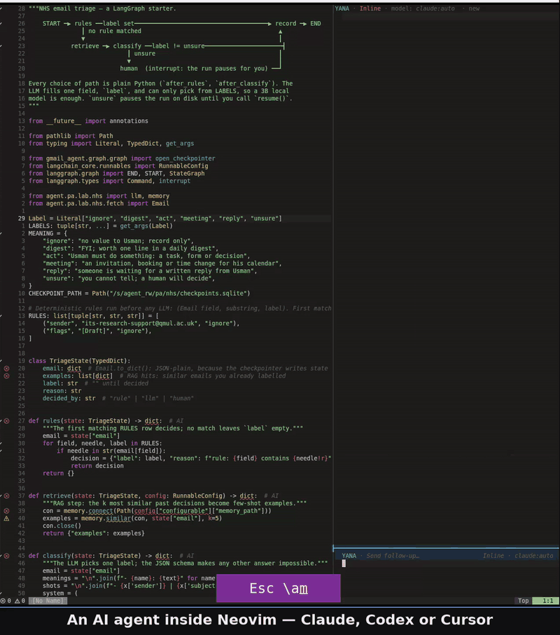

<p align="center"></p>

# Yana

Yana is a Neovim plugin that runs an AI coding agent (Cursor, Claude or Codex)
in a sandbox and shows every change it proposes as a hunk in your own buffer.
You accept or reject each one, and nothing reaches disk until you do.

[](assets/yana-demo.mp4)

## [Features](docs/how-it-works.md)

- **`ask`** (read-only): questions about your code; the agent runs confined and cannot write anything.
- **`inline`** (a copilot with inline, Cursor IDE-like edits): every change arrives as a hunk in your buffer.
  - Accept or reject a hunk, a file or the whole turn
  - Undo and redo your decisions across files
  - Edit a selection, or several repositories in one turn
  - Your unsaved typing is never overwritten
- **`agentic`** (a pass-through wrapper around the AI agent of your choice): writes your files directly, with no review.
- **In every mode:**
  - Switch agent and model mid-chat
  - Queue requests, and stop a stuck turn with one command
  - Paste images from the clipboard into the prompt
  - Reattach to a live session from another tab (`:YanaSessions`)

## Installation

Yana needs Linux (glibc), Neovim 0.11.2 or later, and one agent CLI. On macOS
only `agentic` mode works.

**1. Neovim 0.11.2 or later.** Ubuntu's `apt` installs an older version. Get a
current one from [neovim.io/doc/install](https://neovim.io/doc/install/), for
example the AppImage:

```sh
curl -LO https://github.com/neovim/neovim/releases/latest/download/nvim-linux-x86_64.appimage
chmod u+x nvim-linux-x86_64.appimage && ./nvim-linux-x86_64.appimage
```

**2. System packages.**

```sh
# Debian / Ubuntu
sudo apt-get install -y bubblewrap libcap2-bin python3 util-linux findutils gawk libc-bin hostname
# Fedora / RHEL
sudo dnf install -y bubblewrap libcap python3 util-linux findutils gawk glibc-common hostname
# Arch
sudo pacman -S --needed bubblewrap libcap python3 util-linux findutils gawk glibc inetutils
```

**3. One or more agent CLIs, signed in.** Install any combination, then sign in once:

```sh
curl https://cursor.com/install -fsS | bash     # Cursor, then: cursor-agent login
curl -fsSL https://claude.ai/install.sh | bash  # Claude Code, then: claude (sign in when it asks)
npm install -g @openai/codex                    # Codex (needs Node.js), then: codex login
```

**4. The plugin**, with [lazy.nvim](https://github.com/folke/lazy.nvim). No
configuration is required; Yana starts with the Cursor CLI by default:

```lua
{
  "drusmanbashir/yana.nvim",
  dependencies = { "drusmanbashir/yana-ui" },
  event = "VeryLazy",
  opts = {},
}
```

**5. Check it.** Restart Neovim and run `:checkhealth yana`. It names anything
missing and the command that fixes it. On Ubuntu 24.04 it may report
`bwrap:userns`, because Ubuntu restricts the sandbox Yana uses; apply the fix
it prints.

## Environment setup

No additional setup is normally needed for agent discovery. Yana finds
`cursor-agent`, `claude` and `codex` through Neovim's `PATH`; install any
combination and switch between them with `<C-g>` (agent CLI, then model).

If a CLI is installed in a custom location outside `PATH`, set its optional
environment variable before starting Neovim:

```sh
export YANA_CURSOR_BIN=/custom/path/cursor-agent
export YANA_CLAUDE_BIN=/custom/path/claude
export YANA_CODEX_BIN=/custom/path/codex
```

Only set the variables you need. When present, each overrides that backend's
standard command name. Absolute paths can also be set in `opts.backends`; see
[docs/configuration.md](docs/configuration.md#agent-and-backend).

## Configuration

Every setting has a release default, so you do not need to copy or fill in the
configuration below. `opts = {}` uses these values. Copy only the settings you
want to change; Yana combines them with the remaining defaults (a deep merge).

For example, this starts with the Claude backend and one of its models, leaves
agentic mode out, and adds three optional global mappings; every omitted setting
keeps the default above:

```lua
opts = {
  backend = "claude",        -- initial agent CLI; <C-g> switches CLI and model
  model = "claude-opus-4-8", -- a model id the claude CLI accepts; omit it to let claude choose
  modes = { "inline", "ask" }, -- no "agentic": <M-t> cannot reach it
  mappings = { toggle = "<leader>cc", ask = "<leader>ca", inline_edit = "<C-k>" },
}
```

<details>
<summary>Default (full) configuration</summary>

```lua
opts = {
  backend = "cursor", -- agent CLI to start with: "cursor", "claude" or "codex"; a backend or model picked in the panel (<C-g>) is remembered across restarts
  modes = { "inline", "agentic", "ask" }, -- modes a chat may enter: the first is the starting mode and <M-t> cycles them in this order; "ask" is read-only, "inline" edits arrive as hunks to review, "agentic" writes files directly with no review
  review = {
    ignore = {}, -- gitignore-style patterns written to disk without review; :YanaIgnore adds more
  },
  ui = {
    width = 0.40, -- sidebar width: <=1 is screen fraction, >1 is columns
    prompt_height = 6, -- prompt window rows
    position = "right", -- "left" puts sidebar left; other values use right
    multi_panel_layout = "split", -- "split" stacks chats; "rotate" shows one chat
    spinner = { "⠋", "⠙", "⠹", "⠸", "⠼", "⠴", "⠦", "⠧", "⠇", "⠏" }, -- winbar animation while agent runs
  },
  -- Highlights: each role takes a nvim_set_hl() table, either { link = "Group" } or colours
  -- such as { bg = "#1f4d32", fg = "#ffffff" }. A role you set replaces that role's default.
  diff_highlights = {
    incoming = { link = "DiffAdd" }, -- lines the agent added
    deleted = { link = "DiffDelete" }, -- lines the agent removed
    hint = { link = "Comment" }, -- hint text in the inline review
  },
  -- Keys use Neovim notation. false or "" disables a key, except a review key,
  -- which cannot be disabled: false and "" both restore its default.
  mappings = {
    -- Review buffer, normal and visual mode, while a review is open.
    -- Fixed, not configurable: cR aborts the review, cU resets the turn, u / U / <C-r> undo, undo all, redo.
    accept_hunk = "ca", -- accept the hunk under the cursor
    reject_hunk = "cr", -- reject the hunk under the cursor
    accept_file = "cf", -- accept every hunk in this file
    reject_file = "cx", -- reject this file's remaining hunks
    accept_all = "cA", -- accept every hunk in the whole turn
    next_hunk = "]x", -- next hunk
    prev_hunk = "[x", -- previous hunk
    -- Prompt: the panel prompt and the inline-edit float.
    submit = "<C-s>", -- send the prompt (normal and insert mode)
    stop = "<C-c>", -- stop the running response (prompt and conversation window); closes the inline-edit float from insert mode
    -- Panel.
    model = "<C-g>", -- pick the agent CLI, then its model
    new_chat = "<C-n>", -- start a fresh chat (new session)
    toggle_mode = "<M-t>", -- cycle the chat's mode through modes, in list order
    resend = "<M-r>", -- prefix: then r resends here, n in a new chat, a in a new agent-mode chat
    review = "<C-y>", -- open the review of pending changes
    accept = "<C-a>", -- accept pending changes
    reject = "<C-x>", -- reject pending changes
    focus_prompt = "i", -- from the conversation window, jump to the prompt
    close = "q", -- close the panel (normal mode); also closes the inline-edit float
    next_panel = "<M-.>", -- focus (split) or show (rotate) the next chat
    prev_panel = "<M-,>", -- focus or show the previous chat
    completion_menu = "<C-Space>", -- open slash-command/@mention completion (insert mode; needs blink.cmp)
  },
  skill_dirs = { -- additional skill directories for / completion; project .cursor/skills is always scanned first
    "~/.cursor/skills",
    "~/.cursor/skills-cursor",
    "~/.claude/skills",
  },
  sessions = {
    dir = vim.fn.stdpath("data") .. "/yana", -- chat registry and transcripts
    chats_dir = "~/.cursor/chats", -- where cursor-agent keeps its chats
    max = 50, -- most sessions :YanaSessions lists
  },

  log_level = "info", -- "error", "warn", "info" or "debug"
}
```

</details>


Yana sets no global keys by default; add only the ones you want (`toggle`,
`ask`, `inline_edit`) to `mappings`. `agentic` mode writes your files with no
review; it is in the default `modes`, so leave it out of your list if `<M-t>`
should not reach it. Explanations and valid values for every setting, and the
advanced settings not shown above:
[docs/configuration.md](docs/configuration.md#advanced-settings).

## Usage

1. `:Yana` opens the panel. Type your request in the prompt at the bottom and
   press `<C-s>` to send it.
2. Or select lines and run `:YanaEdit` to change only those lines.
3. The agent's changes appear in your buffers as hunks. Review them:

| Key | Action |
|---|---|
| `ca` / `cr` | Accept / reject the hunk |
| `cf` / `cx` | Accept / reject the file |
| `cA` | Accept the whole turn |
| `]x` / `[x` | Next / previous hunk |
| `u` / `<C-r>` | Undo / redo a decision |
| `U` | Undo the whole turn |

In the panel, `<C-c>` stops the agent and `<C-g>` switches the agent CLI and
its model.

More keys and every command: [docs/usage.md](docs/usage.md). Also
[known issues](docs/known-issues.md), [alternatives](docs/alternatives.md) and
the [roadmap](docs/roadmap.md). Full reference: `:help yana`.

## License

Apache 2.0. See [LICENSE](LICENSE) and [NOTICE](NOTICE).
