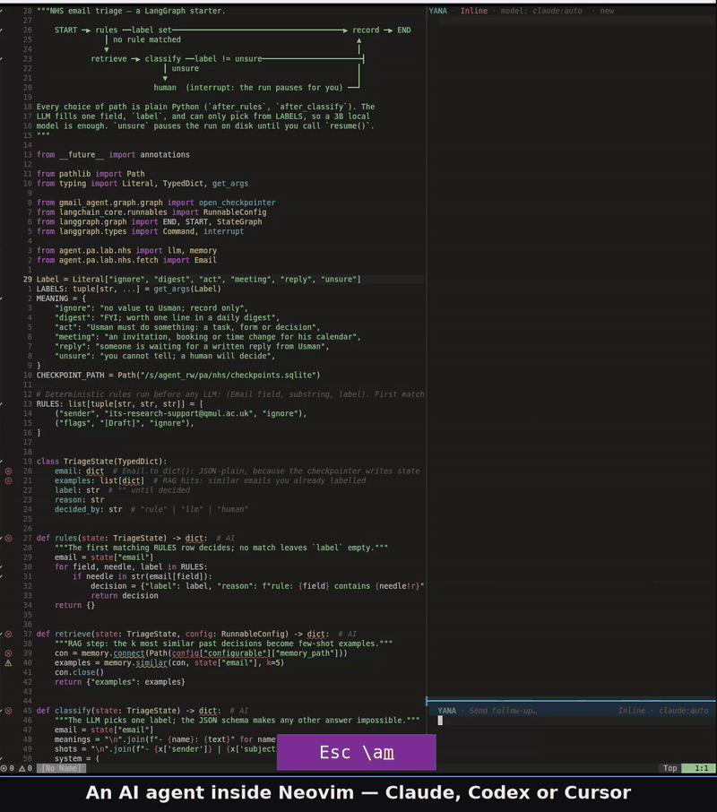

<p align="center"></p>

# Yana

Yana is a Neovim plugin for using Cursor, Claude Code or Codex in your
project. In `inline` mode, the agent's edits appear as hunks in your buffers;
you review and accept them before they reach disk.

[](assets/yana-demo.mp4)

## Features

- `ask` answers questions without writing files.
- `inline` proposes edits for review, with accept, reject, undo and redo.
- `agentic` writes files directly, without hunk review.
- Switch agent and model, queue prompts, stop a turn, paste images, and resume
  sessions across tabs.

[Feature details](docs/how-it-works.md)

## Install

### Prerequisites

Yana requires Neovim 0.11.2+.

Use the optional prerequisite installer script or follow the manual steps
below. Run it as your normal user, not with `sudo`: it checks Neovim and your
agent, then shows each system command and asks before running it with `sudo`.

```sh
curl -fsSLO https://raw.githubusercontent.com/drusmanbashir/yana.nvim/main/scripts/install-deps.sh
bash install-deps.sh
```

#### 1. Install an agent

Choose an installed agent CLI: Claude Code (`claude`), Codex
(`codex`) or Cursor (`cursor-agent`). Use the matching `backend` value
`"claude"`, `"codex"` or `"cursor"` in the Neovim setup below.
After setup, run `:YanaLogin` to sign in through that agent's official login
in a Neovim terminal. Existing API-key authentication keeps working.

<a id="bubblewrap"></a>

#### 2. Install Bubblewrap

In Linux `ask` and `inline` modes, Bubblewrap, also used by
[Flatpak](https://github.com/containers/bubblewrap), keeps the agent's file writes in
a private workspace until you accept them. Install it and its capability tool:

```sh
sudo apt-get install bubblewrap libcap2-bin
```

#### 3. Allow Bubblewrap on Ubuntu

AppArmor is [Ubuntu's application security system](https://documentation.ubuntu.com/security/security-features/privilege-restriction/apparmor/).

On Ubuntu 24.04 and newer with AppArmor's user-namespace restriction, add this
one-time permission for Bubblewrap. First check for an existing profile:

```sh
grep -rl /usr/bin/bwrap /etc/apparmor.d/
```

If a file is printed, ask your administrator to add `userns,` to that profile
and reload it with `sudo apparmor_parser -r FILE`. Otherwise, create it below.
Do not add a second profile for the same executable.

```sh
sudo apt-get install apparmor
sudo tee /etc/apparmor.d/yana-bwrap <<'EOF'
abi <abi/4.0>,
include <tunables/global>
profile yana-bwrap /usr/bin/bwrap flags=(unconfined) {
  userns,
}
EOF
sudo apparmor_parser -r /etc/apparmor.d/yana-bwrap
```

This allows Bubblewrap to create its private environment (a user namespace)
while retaining the restriction for other programs. macOS supports `agentic`
mode only. See the [full requirements and troubleshooting guide](docs/installation.md).

### Neovim setup

Add this plugin declaration to your lazy.nvim configuration. The example
starts with Claude; change `backend` to `"codex"` or `"cursor"` for another CLI.

```lua
{
  "drusmanbashir/yana.nvim",
  dependencies = { "drusmanbashir/yana-ui.nvim" },
  event = "VeryLazy",
  opts = { backend = "claude" },
}
```

lazy.nvim installs the required `yana-ui.nvim` dependency. If you omit
`backend`, Yana starts with Cursor; it does not guess from installed CLIs.

Restart Neovim in your project, run `:checkhealth yana`, then `:Yana`. The
opened project is included automatically. Use `:YanaRoots` only to add other
folders; no model or project-path setting is needed for normal use.

## Use

Run `:Yana`, enter a prompt and press `<C-s>`. Or select lines and run
`:YanaEdit`. Review the proposed hunks with `ca` / `cr`, accept the whole turn
with `cA`, and undo or redo a decision with `u` / `<C-r>`.

See [all commands and keys](docs/usage.md),
[configuration and optional overrides](docs/configuration.md),
[known issues](docs/known-issues.md), [alternatives](docs/alternatives.md),
and the [roadmap](docs/roadmap.md). The full reference is `:help yana`.

## License

Apache 2.0. See [LICENSE](LICENSE) and [NOTICE](NOTICE).
